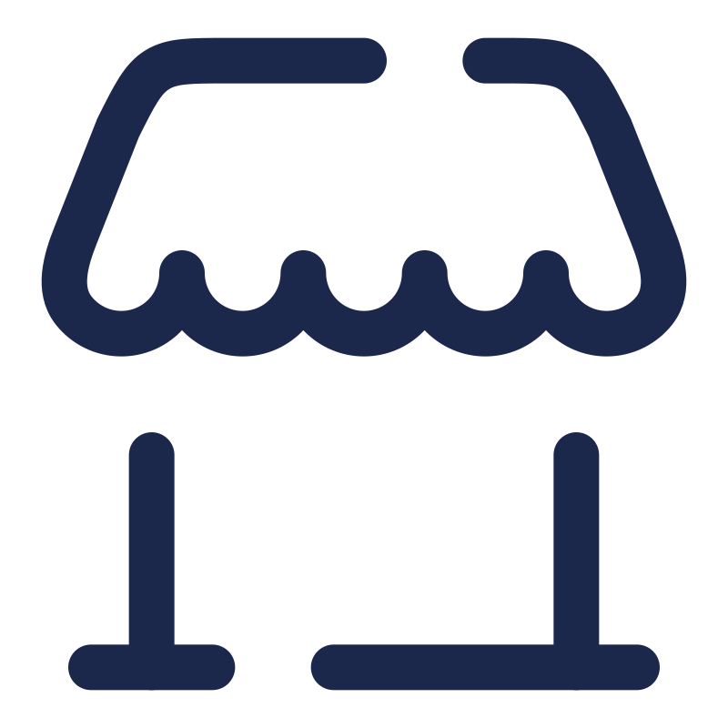
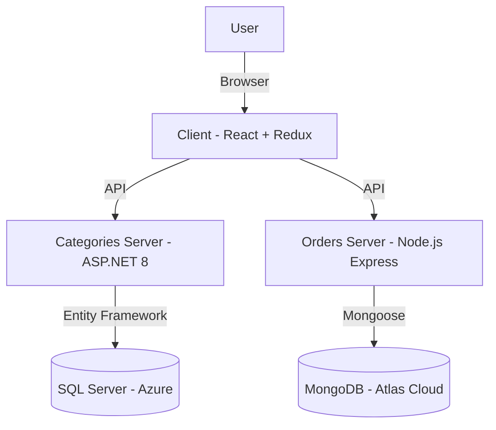
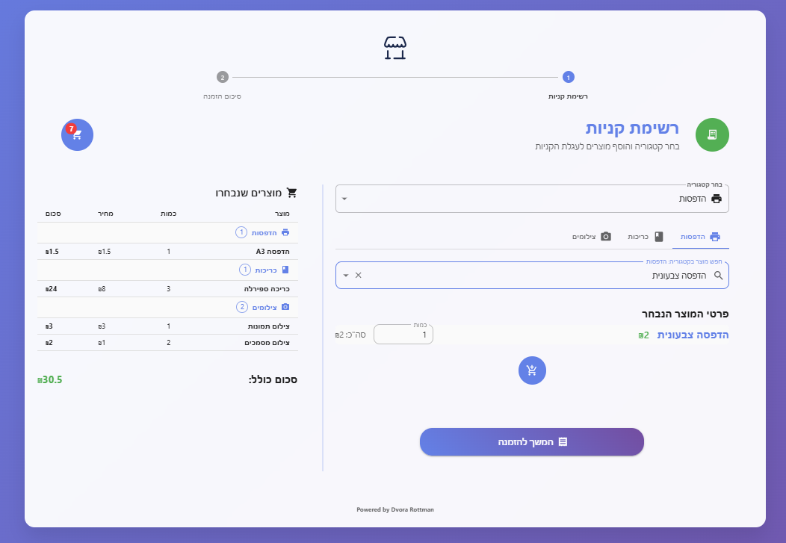
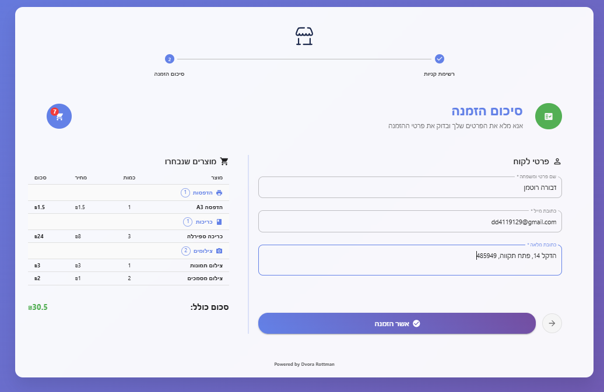
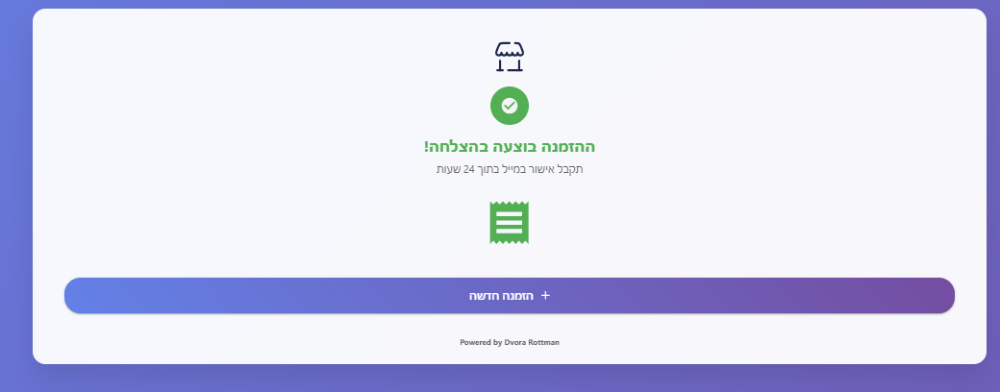
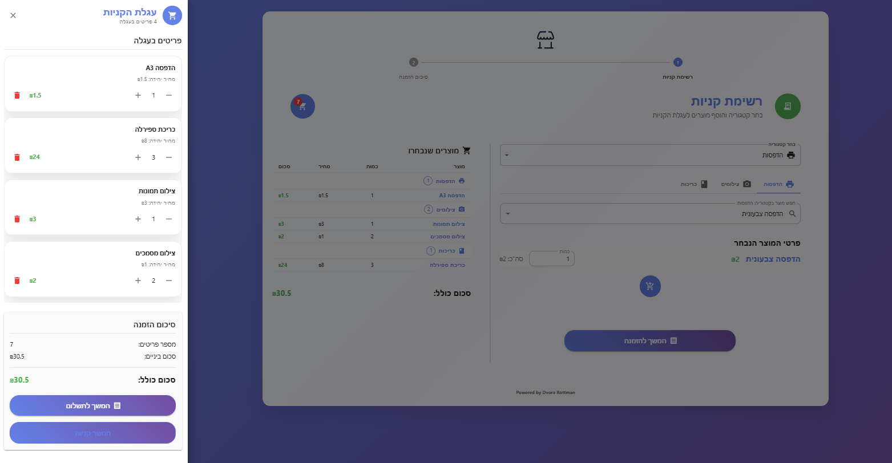
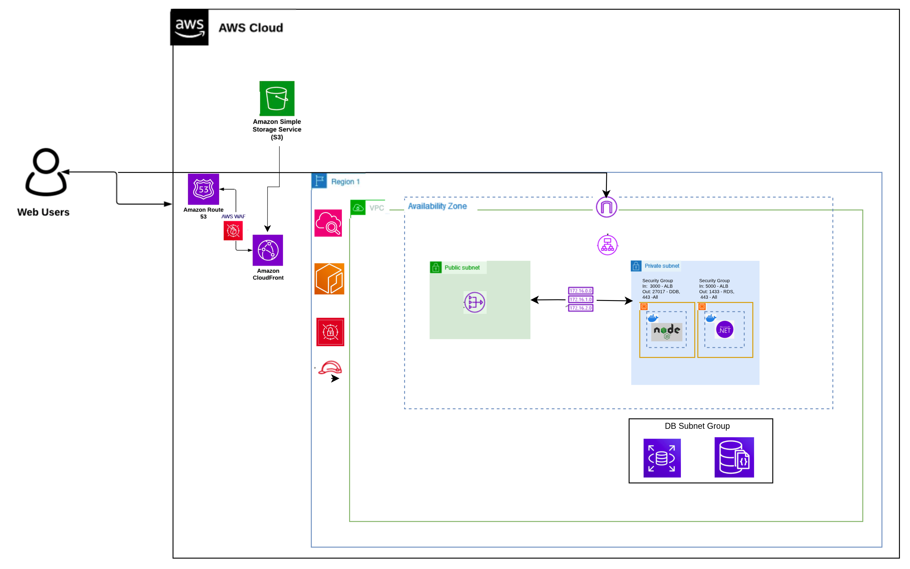

 Shop – Shopping Management System

## Table of Contents
- [Project Overview](#project-overview)
- [Architecture Diagram](#architecture-diagram)
- [Main Technologies](#main-technologies)
- [Project Structure](#project-structure)
- [Cloud Databases](#cloud-databases)
- [Setup & Run Instructions](#setup--run-instructions)
- [Environment and Config Files](#environment-and-config-files)
- [Workflow – Main Screens](#workflow--main-screens)
- [GUI Structure & Hooks](#gui-structure--hooks)
- [API Endpoints](#-api-endpoints)
- [AWS Cloud Deployment](#aws-cloud-deployment)
- [Contact](#contact)

---

## Project Overview

A smart shopping and order management system with a modern UI, ASP.NET server for categories, and Node.js server for orders. The system demonstrates Redux, Entity Framework, MongoDB, and a complete order workflow.

---

> **Note:** The following architecture and cloud deployment are described as a recommended professional solution. The system is designed and documented for such deployment, but is not actually deployed in the cloud.

## Architecture Diagram



---

## Main Technologies

- **Frontend:** React, Redux Toolkit, Vite
- **Backend:** ASP.NET 8 (C#) + Entity Framework Core, Node.js + Express, MongoDB (Mongoose)
- **Other Tools:** Axios, dotenv, JSON config

---

## Project Structure

```
.
├── client/                # React client (GUI)
│   ├── src/
│   │   ├── pages/         # Main screens (Shopping, Order Summary, Success)
│   │   ├── components/    # Reusable UI components
│   │   ├── hooks/         # Custom React hooks (useCart, useProducts, etc.)
│   │   ├── store/         # Redux store and slices
│   │   └── ...
│   ├── public/            # Static files & env config
│   ├── screenshots/       # Screenshots for documentation
│   └── README.md
├── dotnet-server/         # ASP.NET server (categories)
│   ├── Controllers/
│   ├── Data/
│   ├── Models/
│   ├── appsettings.json   # Server config (SQL Azure)
│   └── ...
├── node-server/           # Node.js server (orders)
│   ├── config/
│   ├── models/
│   ├── routes/
│   ├── validations/
│   ├── .env              # Server config (MongoDB Atlas)
│   └── ...
└── ...
```

---

## Cloud Databases

- **SQL Server (Azure):**
  - The categories server uses a SQL Server database hosted on Microsoft Azure (see `dotnet-server/appsettings.json`).
- **MongoDB (Atlas Cloud):**
  - The orders server uses a MongoDB database hosted on MongoDB Atlas Cloud (see `node-server/.env`).

---

## Setup & Run Instructions

> **Note:** If the servers or databases are not available, the system will automatically switch to offline/mock mode and use local fake data. You can still use and demo the client without backend connection.

1. **Set Environment Variables:**
   - Update `dotnet-server/appsettings.json` for SQL Azure connection.
   - Update `node-server/.env` for MongoDB Atlas URI and secrets.

2. **Install Dependencies:**
   - From the root folder, run:
     ```bash
     cd client && npm install
     cd ../node-server && npm install
     # For dotnet-server:
     cd ../dotnet-server
     dotnet restore
     ```

3. **Run All Applications:**
   - Return to the client folder:
     ```bash
     cd ../client
     ```
   - Start all servers and the client together:
     ```bash
     npm run dev
     ```
   - This command runs the React client, Node.js server, and ASP.NET server concurrently
---

## Environment and Config Files

- **Node.js Server:**
  - `node-server/.env` – MongoDB Atlas URI, JWT secret, port, and CORS client URL
  - `node-server/.env.example` – Example file. Copy to `.env` and fill in your values:
    - `MONGODB_URI` – MongoDB Atlas connection string
    - `JWT_SECRET` – JWT secret key
    - `PORT` – Port for running the server
    - `CLIENT_URL` – Client URL for CORS
- **ASP.NET Server:**
  - `dotnet-server/appsettings.json` – SQL Azure connection string and logging
  - `dotnet-server/appsettings.json.example` – Example file. Copy to the same file name and fill in:
    - `DefaultConnection` – SQL Server connection string (server, database, user, password)

---

## Workflow – Main Screens

### 1. Shopping List Screen
- Loads categories from the ASP.NET server on page load.
- Loads products dynamically according to the selected category.
- User can search for products by name within the selected category.
- User selects a category, product, and quantity.
- Clicking "Add to Cart" adds the product to the shopping cart.



### 2. Order Summary Screen
- Proceed to order summary, fill in customer details (name, address, email).
- Displays all selected products.
- Clicking "Confirm Order" sends the order to the Node.js server (saved in MongoDB Atlas).



### 3. Order Success Screen
- Shows a success message and confirmation details.
- Option to start a new order.



### 4. Cart Page
- Dedicated cart page.
- Shows all products currently in the shopping cart, with options to update quantity or remove items.
- Displays order summary and total price.
- Allows navigation back to shopping or to proceed to checkout.



---

## GUI Structure & Hooks

- The GUI is built with React and Redux Toolkit for state management.
- **Custom hooks** are used for modular logic:
  - `useCart` – Manages cart state and actions (add, remove, update quantity, total price).
  - `useProducts` – Handles product/category selection, search, and filtering.
  - `useCartDrawer` – Controls the cart drawer UI.
- Main screens are in `src/pages/` and use these hooks for a clean, maintainable structure.
- UI components are in `src/components/` and are fully reusable.

### Responsive Design

The entire UI is **fully responsive** and optimized for **mobile, tablet, and desktop** screens.  
Built with **Material-UI (MUI)**, it leverages responsive design principles using its Grid system, breakpoints, and adaptive components.
- Mobile users enjoy a seamless experience with adaptive navigation, touch-friendly controls, and a layout tailored to smaller screens.

---

## 🔌 API Endpoints

### ASP.NET 8 – Categories Server

| Method | Endpoint                        | Description                                 |
|--------|----------------------------------|---------------------------------------------|
| GET    | `/api/categories`               | Fetch all available product categories      |
| GET    | `/api/products/{categoryId}`    | Get products by category ID                 |

#### Example Response – `/api/categories`
```json
[
  { "id": 1, "name": "הדפסות", "description": "שירותי הדפסה שונים", "createdAt": "2025-06-27T10:00:00Z" },
  { "id": 2, "name": "צילומים", "description": "שירותי צילום ועיבוד תמונות", "createdAt": "2025-06-27T10:00:00Z" },
  { "id": 3, "name": "כריכות", "description": "שירותי כריכה למסמכים", "createdAt": "2025-06-27T10:00:00Z" }
]
```

#### Example Response – `/api/products/1`
```json
[
  { "id": 1, "name": "הדפסה שחור לבן", "description": "הדפסה איכותית A4", "price": 0.5, "categoryId": 1, "createdAt": "2025-06-27T10:00:00Z" },
  { "id": 2, "name": "הדפסה צבעונית", "description": "הדפסה צבעונית A4", "price": 2.0, "categoryId": 1, "createdAt": "2025-06-27T10:00:00Z" },
  { "id": 3, "name": "הדפסה A3", "description": "הדפסה גדולה A3", "price": 1.5, "categoryId": 1, "createdAt": "2025-06-27T10:00:00Z" }
]
```

---

### Node.js – Orders Server

| Method | Endpoint     | Description                                 |
|--------|--------------|---------------------------------------------|
| POST   | `/api/orders` | Submit an order with user info and cart items |

#### Example Payload
```json
{
  "fullName": "John Doe",
  "email": "john@example.com",
  "address": "123 Main St, Tel Aviv",
  "items": [
    { "productId": "1", "productName": "הדפסה שחור לבן", "quantity": 2, "price": 0.5, "totalPrice": 1.0 },
    { "productId": "4", "productName": "צילום מסמכים", "quantity": 1, "price": 1.0, "totalPrice": 1.0 }
  ],
  "totalAmount": 2.0
}
```

#### Example Response – `/api/orders`
```json
{
  "success": true,
  "message": "Order ORD-000001 created and saved successfully!",
  "order": {
    "id": "665f1e2b7c1a2b0012a3b456",
    "orderNumber": "ORD-000001",
    "status": "confirmed",
    "totalAmount": 2.0,
    "createdAt": "2025-06-27T10:00:00Z",
    "customer": {
      "fullName": "John Doe",
      "email": "john@example.com",
      "address": "123 Main St, Tel Aviv"
    },
    "itemsCount": 2
  }
}
```

---

### AWS Architecture Diagram



---
## AWS Cloud Deployment

In a production cloud environment, both databases are designed to use fully managed AWS services:
- **AWS RDS** for SQL Server (instead of Azure SQL, the system is designed for AWS RDS)
- **AWS DocumentDB** for MongoDB (instead of MongoDB Atlas, the system is designed for AWS DocumentDB)
This approach leverages managed services to provide flexibility, scalability, reliability, and reduced operational overhead.

The system is deployed on AWS using a professional architecture, ensuring security, high performance, and high availability. This is the recommended way to deploy such applications in production environments.

### Main Cloud Components

- 🌐 Distribution & Security Layer:
  - CloudFront + WAF – Global content delivery with attack protection
  - Route 53 – Professional DNS management
  - S3 – Frontend (React) file storage with automatic backup
- 🔒 Network & Security Layer:
  - **VPC with Public/Private Subnets** – Complete separation between public and private resources: EC2 application servers and APIs are deployed in Private Subnets (fully protected, with no direct internet access). The Application Load Balancer (ALB) resides in a Public Subnet, receives incoming traffic from the internet, and securely forwards it to the EC2 instances. When application servers need to access the internet (for updates, package downloads, etc.), this is done via a NAT Gateway, ensuring secure and controlled outbound connectivity.
  - Security Groups – Precise firewall rules for each component
  - NAT Gateway – Controlled internet access from the private network
- ⚙️ Application Layer:
  - EC2 Instances in a private network with advanced Auto Scaling
  - Docker Containers – .NET and Node.js servers in isolated containers
  - ECR – Private Docker image registry with vulnerability scanning
- 💾 Data Layer:
  - RDS SQL Server – Managed database with automatic backups
  - DocumentDB – MongoDB-compatible database with clustering
- 📊 Monitoring & Security:
  - CloudWatch – Real-time monitoring, centralized logs, and alerts
  - Secrets Manager – Secure management of passwords and keys. All database credentials are securely stored in AWS Secrets Manager, allowing the servers to retrieve them safely at runtime without exposing them in code or configuration files.
  - IAM Roles – Precise permissions for each component without exposing credentials
  - VPC Endpoints – Private access to AWS services without traversing the public internet

#### Security Principles Implemented

- Defense in Depth – Multiple layers of protection
- Least Privilege – Only the minimum required permissions
- Network Isolation – Full separation between public and private components
- Encryption at Rest & Transit – All data is encrypted
- Automated Monitoring – Automatic monitoring and anomaly detection

This architecture ensures high availability, automatic scalability, and enterprise-grade security while maintaining cost efficiency.

---

## Contact

For questions or feedback:
dd4119129@gmail.com

---
Thank you for reading!  
Feel free to clone, explore, or improve the system.  
Happy coding!

---
